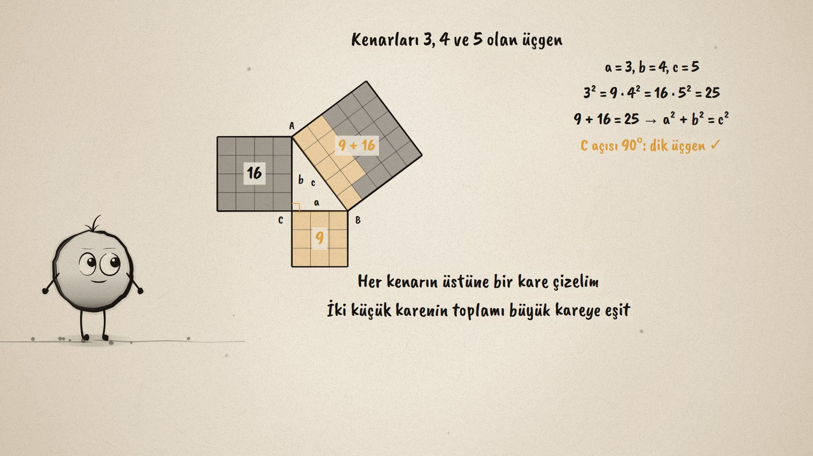
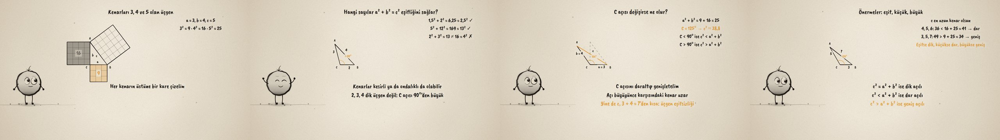

# Karelerin Toplamı · The Sum of the Squares

**▶ Tarayıcıda izleyin / Watch in the browser:** https://hakanatas.github.io/karelerin-toplami/ 
**⬇ MP4 + altyazılar / MP4 + subtitles:** [Releases](https://github.com/hakanatas/karelerin-toplami/releases) 
**✎ Kullanılan istem / The prompt behind it:** [PROMPT.md](PROMPT.md) 
**🎞 Bütün filmler / All films:** [Nokta'nın Filmleri](https://hakanatas.github.io/nokta-filmleri/?sinif=8)

> **TR —** 8. sınıf matematik "Geometrik Şekiller" temasındaki MAT.8.3.5 öğrenme çıktısı için hazırlanmış, tamamen JavaScript ile çizilen 92 saniyelik mürekkep animasyonu. Kenarları 3, 4 ve 5 olan üçgenin her kenarına bir kare çiziliyor: 9 ve 16 birim kare, 25 birimlik büyük kareyi dolduruyor ve kısa kenarlar arasındaki açı tam 90°. Ardından 1,5; 2; 2,5 ve 5, 12, 13 gibi rasyonel sayıların eşitliği sağladığı, 2, 3, 4'ün sağlamadığı görülüyor. 3 ve 4 kenarları sabitken aradaki açı daraltılıp genişletiliyor: açı küçülünce c² 25'ten küçük, büyüyünce büyük oluyor; üçgen eşitsizliği ve açı-kenar ilişkisiyle bağlantı kuruluyor. Önermeler: eşitse dik, küçükse dar, büyükse geniş açılı. Altyazılar Türkçe, İngilizce ya da ikisi birlikte seçilebilir.

A 92-second ink animation for **8th-grade maths**. Nokta, the ink character from [The Learning Ink](https://github.com/hakanatas/the-learning-ink), is the guide again. The triangle is a single shape that changes over time (`shape(t)` in `scenes/scene1.js`): it morphs from triple to triple, then hinges on the angle C while a live readout shows c² against a² + b² = 25.

## Learning outcome

MEB, Türkiye Yüzyılı Maarif Modeli, Ortaokul Matematik, 8th grade, "Geometrik Şekiller" theme:

**MAT.8.3.5. Kenar uzunlukları a²+ b²= c² eşitliğini sağlayan üçgenleri oluşturarak dik üçgen olduklarını; dik üçgenlerde dik kenar uzunluklarının kareleri toplamının hipotenüs uzunluğunun karesine eşit olduğunu yorumlayabilme**
- a) a²+ b²= c² eşitliğini sağlayan rasyonel sayıları inceler.
- b) Kenar uzunlukları a²+ b²= c² eşitliğini sağlayan üçgeni oluşturarak dik üçgen olduğunu; dik üçgenlerde hipotenüs uzunluğunun karesinin diğer iki kenarın uzunluklarının kareleri toplamına eşit olduğunu belirler.
- c) Pisagor bağıntısını üçgende açı-kenar ilişkisi ve üçgen eşitsizliği ile ilişkilendirerek dar açılı ve geniş açılı üçgenlerdeki kenar uzunluklarının ilişkisini ifade eder.

## Scenes

| # | Time | Scene | What happens | Outcome |
|---|---|---|---|---|
| 1 | 0–10 s | Dik açı mı? | Which triangles have a right angle? | b |
| 2 | 10–28 s | Kareler | Squares on the sides of 3, 4, 5: 9 + 16 = 25, and a right angle. | b |
| 3 | 28–46 s | Rasyonel sayılar | 1.5, 2, 2.5 and 5, 12, 13 work; 2, 3, 4 does not. | a, b |
| 4 | 46–64 s | Açı değişince | Narrow the angle: c² < 25; widen it: c² > 25, still c < 7. | c |
| 5 | 64–80 s | Önermeler | 4, 5, 6 is acute; 3, 5, 7 is obtuse. | c |
| 6 | 80–92 s | Özet | Equal, less, greater. | a–c |

## Running it

- **Preview:** double-click `index.html` (it works offline).
- **MP4:** run `npm install` once, then `npm run export -- --format=horizontal --captions=tr`.
- **Subtitles and narration:** `npm run srt` writes `out/captions_*.srt` and `narration_notes.txt`.
- **Editing:**
  - Caption text, timings and narration notes: `captions.js`
  - Everything on screen is drawn by `LI.world(t)` in `scenes/scene1.js` (the triangle, the squares, the angle, the words); the other scenes only set the camera.
  - Nokta's poses: `src/draw/film.js`; layout for 16:9 and 9:16: `src/draw/kd.js`

It uses the same engine as The Learning Ink: `renderFrame(t)` as a pure function of time, seeded randomness, and frame-by-frame export.
